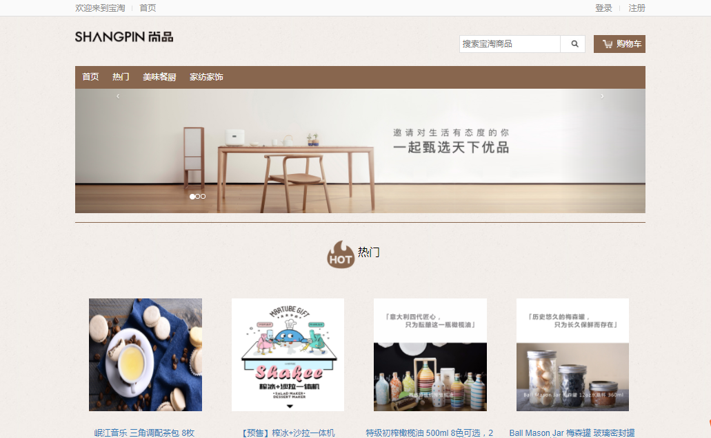

# shopping-website
- 购物网站

''' 
pip install django-bootstrap-toolkit
pip install django-cart
'''
##2017.08.12
添加分页功能
在admin中添加搜索

##2017.08.06
添加爬虫app
增加控制爬虫启动页面

## 2017.8.4
cart 修改

## 2017.7.26
优化了数据库表格结构
修改的admin的显示内容

## 2017.7.22
优化urls
优化了views 中cart部分

## 2017.7.21
使用Django 的auth认证

## 2017.6.26
- 登陆
- 商品列表
- 商品分类
- 商品详情
- 半完成的购物车

